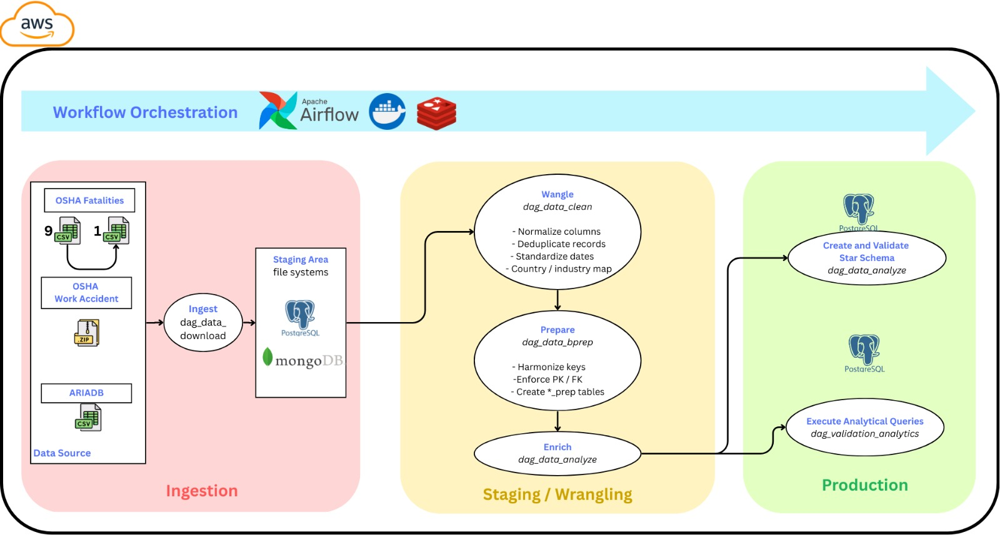
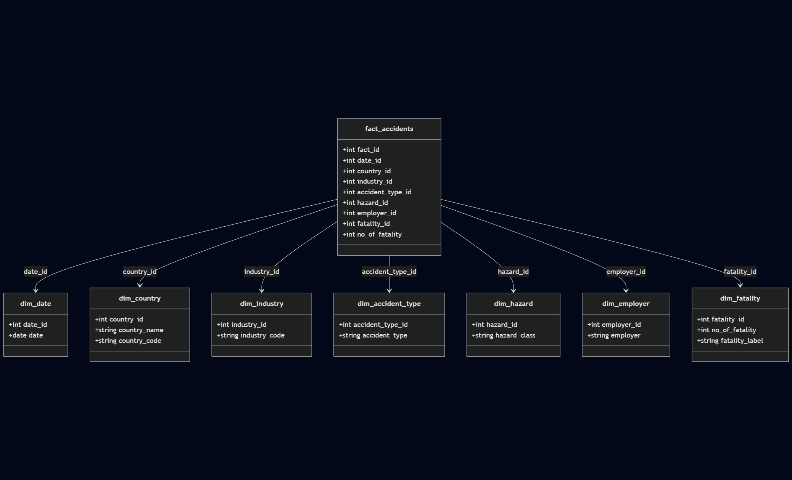

# Report: Occupational Accidents Analytics Platform


Project [DATA Engineering](https://www.riccardotommasini.com/courses/dataeng-insa-ot/) is provided by [INSA Lyon](https://www.insa-lyon.fr/).

Students:
-   Nguyen Sang (sang.nguyen@insa-lyon.fr)
-   Lancelot Tariot Camille (lancelot.tariot-camille@insa-lyon.fr)
-   Loe Louis-Marie (louis-marie.loe@insa-lyon.fr)


## Table of contents

-   [Introduction](#introduction)
-   [Data sources](#data-sources)
-   [Pipeline](#pipeline)
    -   [Ingestion](#ingestion)
    -   [Staging](#staging)
        -   [Cleansing](#cleansing)
        -   [Transformations](#transformations)
        -   [Enrichments](#enrichments)
    -   [Production](#production)
        -   [Star schema](#star-schema)
        -   [Queries](#queries)
-   [Environment](#environment)
-   [How to run](#how-to-run)
    -   [Automatic](#automatic)
    -   [Manual](#manual)
    -   [EC2 setup (optional)](#ec2-setup-optional)
-   [Validation and monitoring](#validation-and-monitoring)
-   [Future developments](#future-developments)
-   [Project submission checklist](#project-submission-checklist)
-   [License](#license)

## Introduction

This project implements an end-to-end, containerized data pipeline that ingests public occupational accident datasets (ARIA and OSHA), cleans and standardizes them, and builds a PostgreSQL star schema for reproducible analytics. The report you are reading is the full project report, including the pipeline design, run instructions, and analysis queries.

## Data sources

-   **ARIADB (France)**: [Accidents industriels et technologiques (ARIA)](https://www.data.gouv.fr/api/1/datasets/r/e4a3ad9a-cc9d-40c6-8d1a-aebdf75ded7b)
-   **OSHA Work Accident Case Files (USA)**: [January 2015 to March 2025 accident case files](https://www.osha.gov/sites/default/files/January2015toMarch2025.zip)
-   **OSHA Fatality Summaries (USA)**: nine CSVs published by OSHA for fiscal years 2009-2017 (`CSV_URLS_FATALITIES` in `dags/etl_utils.py`)

## Pipeline



The Airflow orchestration chain is:

1. `dag_data_download` (download raw datasets to `/opt/airflow/data`)
2. `dag_data_clean` (cleaning + standardized tables)
3. `dag_data_bprep` (prep tables ready for star schema)
4. `dag_data_bcreate_star_schema` (dimensions, fact table, tests)
5. `dag_data_analytics_validation` (automated validation queries)

### Ingestion

-   ARIADB is downloaded via a MongoDB staging step to enforce schema-safe ingestion before exporting to CSV and loading to Postgres.
-   OSHA work accidents are downloaded as a ZIP file and extracted to a single CSV.
-   OSHA fatalities are downloaded as nine CSV files with retries and local fallback.

### Staging

#### Cleansing

-   Column names are normalized (lowercase snake_case, accents removed).
-   Dates are standardized to ISO format.
-   Duplicates are removed on primary identifiers (e.g., `aria_id`, `upa`).
-   Countries are normalized (e.g., USA/US/United States -> `USA`).

#### Transformations

-   Raw tables are filtered to the required columns for analytics.
-   Clean tables are reshaped into `*_prep` tables to align with star schema keys.
-   Types are enforced for numeric identifiers and metrics.

#### Enrichments

-   Country codes are derived for `dim_country`.
-   Employer names and hazard classes are standardized before dimension loading.

### Production

The production phase builds a star schema in `data_db` and runs validation queries.

#### Star schema



-   Dimensions: `dim_date`, `dim_country`, `dim_industry`, `dim_accident_type`, `dim_hazard`, `dim_employer`, `dim_fatality`
-   Fact table: `fact_accidents` (one record per standardized accident)

#### Queries

The following 9 queries are executed by `dag_data_analytics_validation` and saved to `./data/analytics_results` once the star schema build completes.

1. Fatalities by year

```sql
SELECT
    d.date AS year,
    SUM(f.no_of_fatality) AS total_fatalities
FROM fact_accidents f
JOIN dim_date d ON f.date_id = d.date_id
GROUP BY d.date
ORDER BY d.date
```

2. Fatalities by country

```sql
SELECT
    c.country_name AS country,
    SUM(f.no_of_fatality) AS total_fatalities
FROM fact_accidents f
JOIN dim_country c ON f.country_id = c.country_id
GROUP BY c.country_name
ORDER BY total_fatalities DESC
```

3. Fatalities by industry

```sql
SELECT
    i.industry_code AS industry,
    SUM(f.no_of_fatality) AS total_fatalities
FROM fact_accidents f
JOIN dim_industry i ON f.industry_id = i.industry_id
GROUP BY i.industry_code
ORDER BY total_fatalities DESC
```

4. France vs USA fatalities (last 10 years)

```sql
SELECT
    d.date AS year,
    SUM(CASE WHEN c.country_name = 'FRANCE'
             THEN f.no_of_fatality ELSE 0 END) AS france,
    SUM(CASE WHEN c.country_name = 'USA'
             THEN f.no_of_fatality ELSE 0 END) AS usa
FROM fact_accidents f
JOIN dim_country c ON f.country_id = c.country_id
JOIN dim_date d ON f.date_id = d.date_id
WHERE d.date >= (CURRENT_DATE - INTERVAL '10 years')
GROUP BY d.date
ORDER BY d.date
```

5. Top 10 countries by fatalities

```sql
SELECT
    c.country_name,
    SUM(f.no_of_fatality) AS total_fatalities
FROM fact_accidents f
JOIN dim_country c ON f.country_id = c.country_id
JOIN dim_date d ON f.date_id = d.date_id
GROUP BY c.country_name
ORDER BY total_fatalities DESC
LIMIT 10
```

6. Top 10 industries by fatalities

```sql
SELECT
    i.industry_code,
    SUM(f.no_of_fatality) AS total_fatalities
FROM fact_accidents f
JOIN dim_industry i ON f.industry_id = i.industry_id
JOIN dim_country c ON f.country_id = c.country_id
JOIN dim_date d ON f.date_id = d.date_id
GROUP BY i.industry_code
ORDER BY total_fatalities DESC
LIMIT 10
```

7. Top 10 employers by fatalities

```sql
SELECT
    e.employer,
    SUM(f.no_of_fatality) AS total_fatalities
FROM fact_accidents f
JOIN dim_employer e ON f.employer_id = e.employer_id
JOIN dim_country c ON f.country_id = c.country_id
JOIN dim_date d ON f.date_id = d.date_id
GROUP BY e.employer
ORDER BY total_fatalities DESC
LIMIT 10
```

8. Top 10 countries by fatalities (last 10 years)

```sql
SELECT
    c.country_name,
    SUM(f.no_of_fatality) AS total_fatalities
FROM fact_accidents f
JOIN dim_country c ON f.country_id = c.country_id
JOIN dim_date d ON f.date_id = d.date_id
WHERE d.date >= (CURRENT_DATE - INTERVAL '10 years')
GROUP BY c.country_name
ORDER BY total_fatalities DESC
LIMIT 10
```

9. Fatalities trend by industry (last 10 years)

```sql
SELECT
    d.date AS year,
    i.industry_code,
    SUM(f.no_of_fatality) AS total_fatalities
FROM fact_accidents f
JOIN dim_industry i ON f.industry_id = i.industry_id
JOIN dim_date d ON f.date_id = d.date_id
JOIN dim_country c ON f.country_id = c.country_id
WHERE d.date >= (CURRENT_DATE - INTERVAL '10 years')
GROUP BY d.date, i.industry_code
ORDER BY d.date, total_fatalities DESC
```

## Environment

### Stack

-   Apache Airflow 3.1 (Celery Executor + Redis)
-   PostgreSQL 16 (`data_db` for project tables)
-   MongoDB 7 (ARIADB staging)

### Services

| Service           | URL                   | Default credentials        | Notes                                                                     |
| ----------------- | --------------------- | -------------------------- | ------------------------------------------------------------------------- |
| Airflow UI / API  | http://localhost:8080 | `airflow` / `airflow`      | Unpause and trigger DAGs, inspect task logs, clear runs.                  |
| pgAdmin           | http://localhost:5050 | `admin@admin.com` / `root` | Use for database browsing. Default connection is available under Servers. |
| Mongo Express     | http://localhost:8085 | `admin` / `admin`          | Inspect the temporary ARIADB collection after download.                   |
| Redis             | n/a                   | n/a                        | Used internally by Airflow Celery, no UI exposed.                         |

PgAdmin connection details (if you create a new server):

-   Hostname: `postgres`
-   Maintenance database: `postgres`
-   Username: `data_user`
-   Password: `root`

Databases in Postgres:

-   `airflow` for Airflow metadata only
-   `postgres` as the maintenance database
-   `data_db` for all project tables

Python dependencies are installed from `requirements.txt`. It includes only the runtime dependencies required by the ETL (Airflow, pandas, pymongo, psycopg2-binary).

## How to run

### Automatic

```powershell
docker compose up --build -d
docker compose ps
```

### Manual

1. Review `.env`, update ports or credentials if needed.
2. Start the stack: `docker compose up --build -d`.
3. Open Airflow at http://localhost:8080 and trigger `dag_data_download`.
4. The DAGs will chain automatically until analytics validation completes.
5. Query results are in Postgres `data_db` and validation outputs are in `./data/analytics_results`.

Notes:

-   The ETL is idempotent and deterministic. Each run drops and recreates the same set of tables from fixed sources.
-   Do not run analytical queries while DAGs are running. Run queries either before launching a new run or after all DAGs finish successfully.

### EC2 setup (optional)

1. Review `setup_ec2_etl.sh` and set `REPO_URL` to your repository.
2. Run `bash setup_ec2_etl.sh` on a fresh Ubuntu EC2 instance.
3. Ensure a `.env` file exists in the cloned repo before launching the stack.

## Validation and monitoring

-   `dag_data_bcreate_star_schema` runs `min_test_star_schema` and `full_test_star_schema` before analytics.
-   `dag_data_analytics_validation` fails fast if `dim_date` is empty and stores SQL + results for auditing.
-   Airflow logs are mounted under `./logs`; raw and analytics outputs are in `./data`.

## Future developments

-   Provide offline sample datasets to allow full testing without network access.
-   Extend the star schema with additional dimensions (e.g., region or employer sector).

## Project submission checklist

-   [x] Repository with the code, well documented
-   [x] Docker-compose file to run the environment
-   [x] Detailed description of the various steps
-   [x] Report in the README with project design steps divided per area
-   [x] Example dataset for offline testing (sample data not yet included)
-   [x] Slides for the project poster (add `poster.md` or `slides.md`)
-   [x] Airflow + pandas + MongoDB + Postgres used in the pipeline
-   [x] Star schema built in Postgres

## License

This project is released under the [CC0 1.0 Universal](LICENSE) license.
